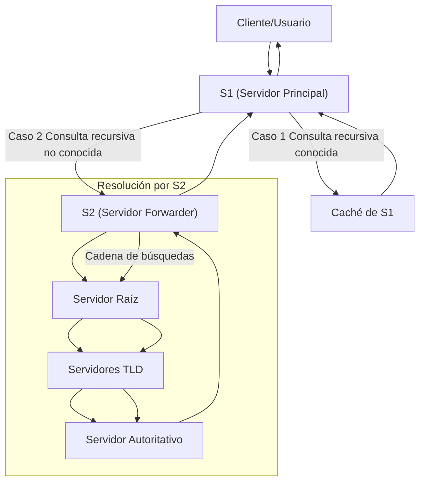

En el Sistema de Nombres de Dominio (DNS), los *forwarders* son servidores configurados para recibir consultas recursivas de otros servidores y realizar toda la cadena de búsquedas en su lugar. Este mecanismo optimiza la resolución de nombres en ciertos escenarios.

## Funcionamiento

1. Comportamiento de S1 (servidor principal):
	1. Si S1 recibe una consulta recursiva:
		1. Caso 1: S1 conoce la respuesta y la devuelve directamente.
		2. Caso 2: S1 no conoce la respuesta y la consulta se reenvía a otro servidor, S2, configurado como *forwarder*.
2. Rol de S2 (*forwarder*):
	1. S2 se encarga de realizar toda la cadena de búsquedas necesarias para resolver la consulta y devuelve la respuesta a S1.
	2. Este enfoque descarga la responsabilidad de S1, que actúa únicamente como intermediario.

## Ventajas del uso de Forwarders

- Mejor conexión con Internet:
	- Si S1 tiene una mala conexión a Internet pero S2 no, redirigir las consultas a S2 mejora la eficiencia y reduce la latencia.
- Aprovechamiento de la caché:
	- Centralizar las consultas de múltiples servidores en un único forwarder (S2) permite aprovechar su caché de respuestas DNS.
	- Esto reduce el tiempo de resolución y la cantidad de consultas que deben enviarse a los servidores DNS externos.
- Simplificación de la gestión:
	- Facilita la administración al concentrar la lógica de resolución en un único servidor.
#### **Escenarios de Uso**

- **Conexión limitada**:    
    - Una sucursal con acceso limitado a Internet utiliza un servidor forwarder en la oficina central para resolver nombres.
- **Optimización de recursos**:
	- Una red con múltiples servidores DNS distribuidos centraliza las consultas en un único forwarder para reducir el tráfico y aprovechar la caché.
- **Políticas de seguridad**:
	- Las consultas DNS pasan primero por un forwarder configurado para aplicar reglas de filtrado o monitorización.