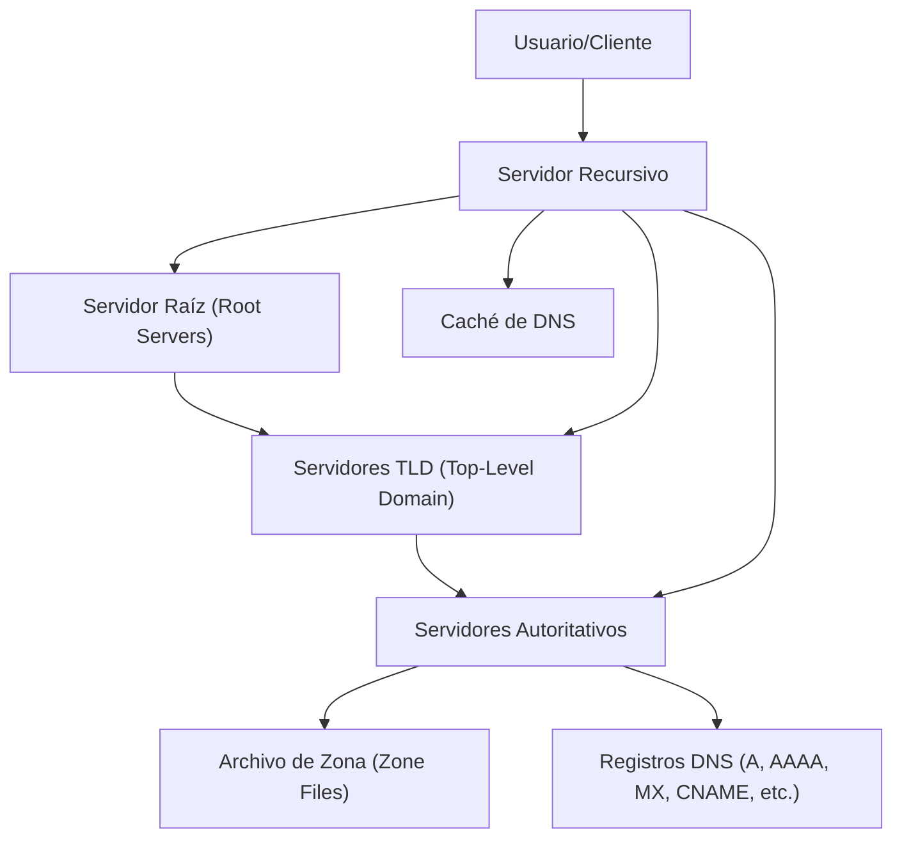

# Estructura

1. **Servidor Raíz (Root Servers):**
    
    - Primer nivel de la jerarquía DNS.
    - Redirige las consultas al servidor correspondiente del **Top-Level Domain (TLD)**.
    - Hay 13 grupos de servidores raíz distribuidos globalmente, identificados de "a.root-servers.net" a "m.root-servers.net".

1. **Servidores TLD:**
    
    - Administran los dominios de nivel superior, como `.com`, `.org`, `.net`, `.es`.
    - Redirigen a los servidores autoritativos correspondientes al dominio solicitado.

1. **Servidores Autoritativos:**
    
    - Contienen la información final del dominio específico, como `ejemplo.com`.
    - Almacenan registros DNS (A, AAAA, MX, etc.) y responden con la información solicitada.

1. **Servidor Recursivo:**
    
    - El intermediario que realiza la consulta completa por el cliente.
    - Puede almacenar respuestas en su **caché** para acelerar consultas futuras.

1. **Cliente/Usuario:**
    
    - El dispositivo que inicia la consulta DNS, generalmente a través de un navegador u otra aplicación.

### Funcionamiento:

1. El cliente envía la consulta al **servidor recursivo**.
2. El servidor recursivo consulta los servidores en el siguiente orden:
    - **Servidor Raíz**, que redirige al servidor TLD.
    - **Servidor TLD**, que redirige al servidor autoritativo del dominio solicitado.
    - **Servidor Autoritativo**, que responde con el registro DNS solicitado (por ejemplo, una dirección IP).

Este modelo jerárquico asegura la escalabilidad y redundancia del sistema DNS. Procedamos a estudiar detenidamente sus componentes.