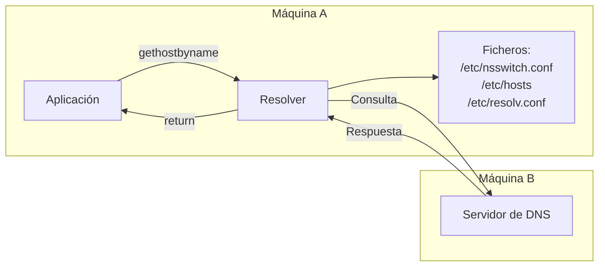

- Son **programas** o **librerías de funciones** que formulan consultas a los servidores DNS.
- El proceso mediante el cual el servidor encuentra la respuesta es **transparente** para los resolvers.

## **Características de los Resolvers**

- Los resolvers son los **clientes** del sistema DNS.
- **Funcionamiento**:
    1. **Consultan al servidor** de DNS para obtener información.
    2. **Interpretan la respuesta**:
        - Si la respuesta no llega o es incorrecta, pueden volver a formular la consulta.
    3. **Devuelven la información** al programa o sistema que realizó la solicitud.

## **Pasos en una Consulta de Resolución de Nombres (GNU/Linux)**

1. **Consulta en el archivo `/etc/hosts`**:
    - Se revisa este archivo para buscar una resolución local.
2. **Consulta en un servidor DNS**:
    - Si no se resuelve en `/etc/hosts`, se consulta un servidor DNS cuya dirección IP está configurada en `/etc/resolv.conf`.
3. **Orden de búsqueda definido por `/etc/nsswitch.conf`**:
    - Este archivo determina:
        - Si se consulta primero el archivo `/etc/hosts` y/o el servidor DNS.
        - El orden en que se realizan las consultas.

