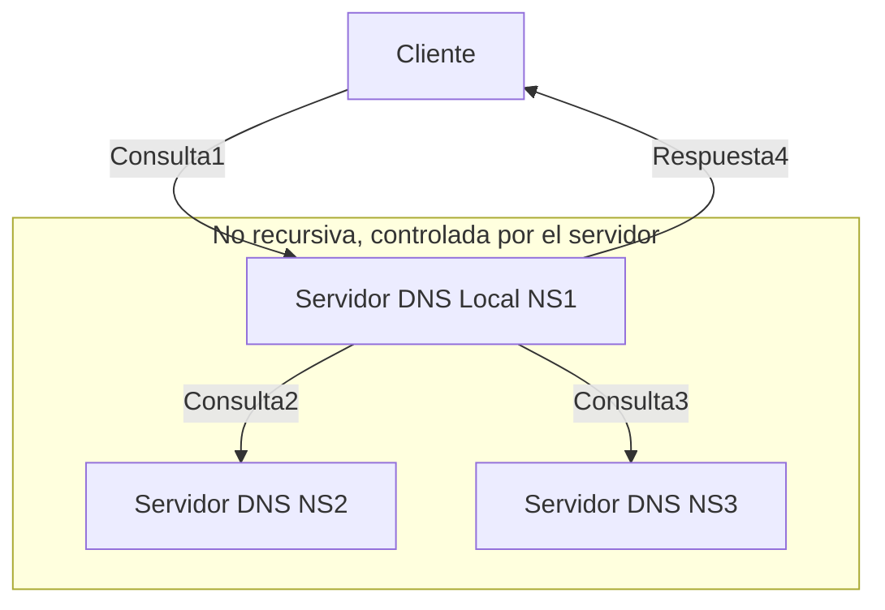
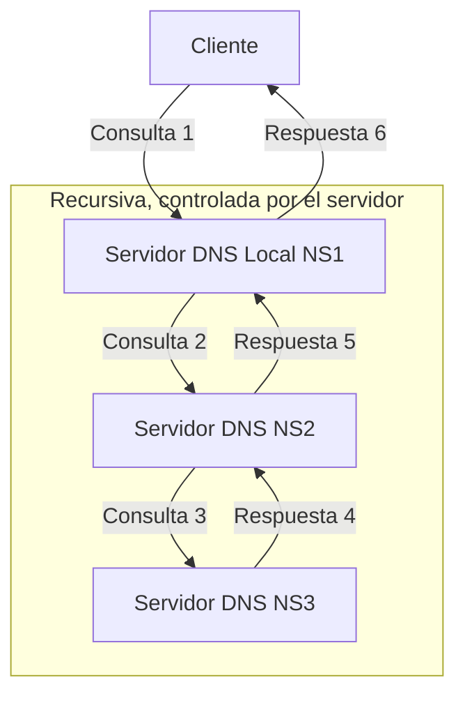

El proceso de **resolución de nombres** consiste en buscar en el **espacio de nombres de dominio** la información asociada a un dominio concreto.

1. Cuando un servidor recibe una consulta de un **resolver**, busca en sus registros la información correspondiente. Si la encuentra, la devuelve.
2. Los servidores DNS pueden responder a dos tipos de consultas:
    - **Consultas Iterativas (no recursivas)**
    - **Consultas Recursivas**

## Consultas Iterativas (No Recursivas)

Cuando un cliente formula una consulta iterativa a un servidor DNS, este servidor:

- Devuelve la dirección IP si la conoce.
- Si no la conoce, responde con la dirección de otro servidor que podría resolver el nombre.

> **Nota:** Este método de consulta es poco utilizado. En este caso, las consultas a los servidores adicionales (como NS2, NS3, etc.) son realizadas por el servidor local (por ejemplo, NS1).

1. El Cliente envía la consulta al servidor local (NS1).
1. El servidor NS1 consulta a otros servidores DNS (NS2, NS3, etc.) según sea necesario.
1. El servidor NS1 devuelve la respuesta al Cliente (ya sea la dirección IP o información adicional sobre otro servidor que puede resolver el nombre).

## Consultas Recursivas

Cuando un cliente realiza una consulta recursiva a un servidor DNS, este:

- Debe intentar resolver la consulta por todos los medios posibles, incluso si eso implica consultar a otros servidores.

> **Nota:** Este es el método de consulta más frecuente.

1. El **Cliente** envía una consulta al **Servidor Local (NS1)**.
2. El **NS1** realiza la consulta al siguiente servidor DNS en la jerarquía (**NS2**).
3. El **NS2** consulta al siguiente servidor (**NS3**) si no tiene la información solicitada.
4. El **NS3** responde con la información al **NS2**.
5. El **NS2** devuelve la información al **NS1**.
6. Finalmente, el **NS1** responde al **Cliente** con la información solicitada.

Este flujo representa cómo funciona una consulta recursiva, donde cada servidor intermedio realiza la consulta en lugar del cliente, simplificando el proceso desde la perspectiva del cliente.
