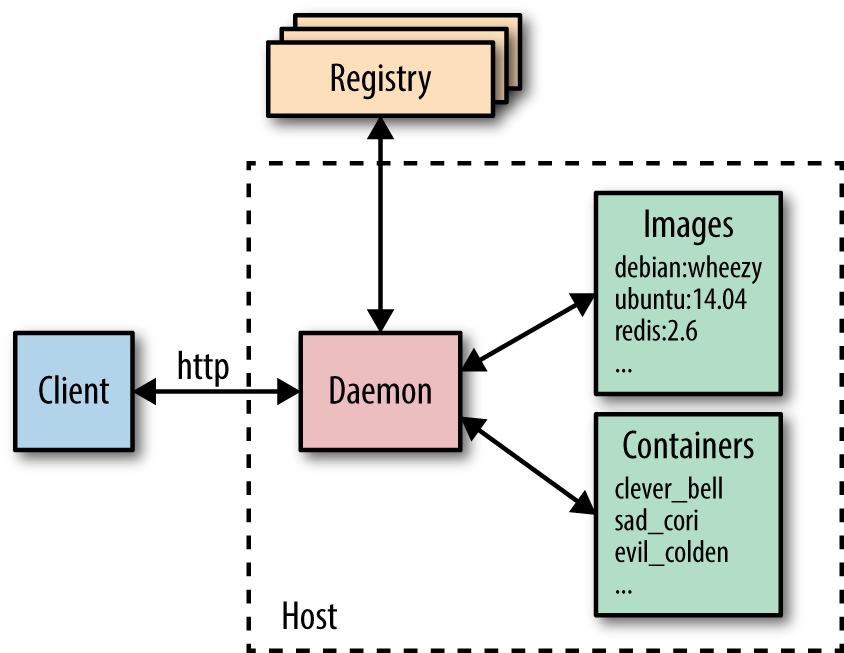

Docker está formado fundamentalmente por tres componentes:

-   Docker Engine
-   Docker Client
-   Docker Registry

## Docker Engine o Demonio Docker:

Es un demonio que corre sobre cualquier distribución de Linux (y ahora también en Windows) y que expone una API externa para la gestión de imágenes y contenedores (y otras entidades que se van añadiendo en sucesivas distribuciones de docker como volúmenes o redes virtuales). Podemos destacar entre sus funciones principales:

- Creación de imágenes docker.
- Publicación de imágenes en un Docker Registry o Registro de Docker (otro componente  Docker que se explicará a continuación).
- Descarga de imágenes desde un Registro de Docker
- Ejecución de contenedores usando imágenes locales.

Otra función fundamental del Docker Engine es la gestión de los contenedores en ejecución, permitiendo parar su ejecución, rearrancarla, ver sus logs o sus estadísticas de uso de recursos.

## Docker Registry o Registro Docker

El Registro es otro componente de Docker que suele correr en un servidor independiente y donde se publican las imágenes que generan los Docker Engine de tal manera que estén disponibles para su utilización por cualquier otra máquina. Es un componente fundamental dentro de la arquitectura de Docker ya que permite distribuir nuestras aplicaciones. El Registro de Docker es un proyecto open source que puede ser instalado gratuitamente en cualquier servidor, pero Docker ofrece Docker Hub, un sistema SaaS de pago donde puedes subir tus propias imágenes, acceder a imágenes públicas de otros usuarios, e incluso a imágenes oficiales de las principales aplicaciones como son: MySQL, MongoDB, RabbitMQ, Redis, etc.

El registro de Docker funciona de una manera muy parecida a git (de la misma manera que Dockerhub y us métodos de pago funcionan de una manera muy parecida a Github). Cada imagen, también conocida como repositorio, es una sucesión de capas. Es decir, cada vez que hacemos un build en local de nuestra imagen, el Registro de Docker sólo almacena el diff respecto de la versión anterior, haciendo mucho más eficiente el proceso de creación y distribución de imágenes.

## Docker Client o Cliente Docker

Es **cualquier herramienta que hace uso de la api remota del Docker Engine**, pero suele hacer referencia al comando `docker` que hace las veces de herramienta de línea de comandos (cli) para gestionar un Docker Engine. La cli de docker se puede configurar para hablar con un Docker Engine local o remoto, permitiendo gestionar tanto nuestro entorno de desarrollo local, como nuestros servidores de producción.
