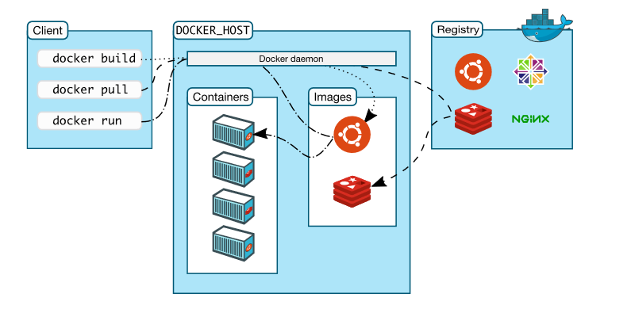

El **Registro docker** es un componente donde se almacena las imágenes generadas por el Docker Engine. Puede estar instalada en un servidor independiente y es un componente fundamental, ya que nos permite distribuir nuestras  aplicaciones. Es un proyecto open source que puede ser instalado  gratuitamente en cualquier servidor, pero, como hemos comentado, el proyecto nos ofrece [Docker Hub](https://hub.docker.com/)



El nombre de una imagen suele estar formado por tres partes:

```
usuario/nombre:etiqueta
```

- `usuario`: El nombre del usuario que la ha generado. Si la subimos a Docker Hub  debe ser el mismo usuario que tenemos dado de alta en nuestra cuenta.  Las **imáges oficiales** en Docker Hub no tienen nombre de usuario.
- `nombre`: Nombre significativo de la imagen.
- `etiqueta`: Nos permite versionar las imágenes. De esta manera controlamos los cambios que se van produciendo en ella. Si no indicamos etiqueta, por defecto se usa la etiqueta `latest`, por lo que la mayoría de las imágenes tienen una versión con este nombre.