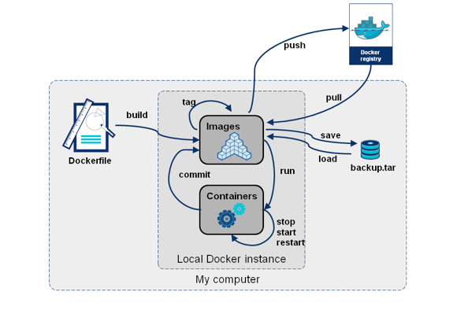

# 05.- Gestión de imágenes

Hasta ahora hemos creado contenedores a partir de las imágenes que encontramos en Docker Hub. Estas imágenes las han creado otras personas.

Para crear un contenedor que sirva nuestra aplicación, tendremos que crear una imagen personaliza, es lo que llamamos “dockerizar” una aplicación.

Una imagen docker es un paquete autocontenido que contiene todo lo necesario para ejecutar una aplicación o servicio en un contenedor docker. Hay dos formas principales de crear una imagen docker:

- [A partir de un contenedor](01.-Imagen%20a%20partir%20de%20un%20contenedor.md): Consiste en crear un contenedor a partir de una imagen base, modificarlo según las necesidades y luego guardar los cambios como una nueva imagen. Esta forma es útil para hacer pruebas rápidas o personalizar una imagen existente.

- [A partir de un `Dockerfile`](02.-Imagen%20a%20partir%20de%20un%20fichero%20Dockerfile.md): La segunda forma consiste en escribir un Dockerfile con las instrucciones para construir la imagen desde cero. Esta forma es más recomendable para automatizar el proceso de creación de imágenes, documentar los pasos y facilitar la reproducción y el mantenimiento de la imagen.

