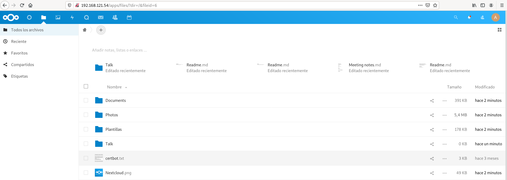

# Ejemplo 1: Contenedor nextcloud con almacenamiento persistente

Vamos a desplegar un contenedor con nextcloud, para simplificar la instalación vamos a realizar la instalación con una base de dato SQLite. Si estudiamos la documentación de la imagen [`nextcloud`](https://hub.docker.com/_/nextcloud) en Docker Hub, la forma más sencilla de no perder la información es crear un volumen para guardar el directorio `/var/www/html` del contenedor. Vamos a realizar el ejercicio usando volúmenes docker y bind mount.

## Ejemplo con volúmenes

Creamos un volumen:

```
$ docker volume create nextcloud
nextcloud
```

Y creamos el contenedor, guardando el directorio `/var/www/html` del contenedor en el volumen creado:

```
$ docker run -d -p 80:80  -v nextcloud:/var/www/html --name contenedor_nextcloud nextcloud
```

Comprobamos que podemos acceder, terminamos de configurar la aplicación y una vez operativa subimos los ficheros a la aplicación:



A continuación eliminamos el contenedor y creamos uno nuevo con el mismo volumen:

```
$ docker rm -f contenedor_nextcloud

$ docker run -d -p 80:80  -v nextcloud:/var/www/html --name contenedor_nextcloud nextcloud
```

Accede de nuevo a la aplicación comprueba que la aplicación sigue configurada y que los ficheros subidos no se han perdido.

## Ejemplo con bind mount

En este caso, vamos a crear un directorio en nuestro ordenador, que es el que vamos a montar en el contenedor:

```
mkdir datos_nextcloud
```

Y creamos el contenedor con la siguiente instrucción:

```
docker run -d -p 80:80 -v /home/vagrant/datos_nextcloud:/var/www/html --name contenedor_nextcloud nextcloud
```

Volvemos a acceder, configuramos la aplicación y subimos algún fichero. Usando bind mount tenemos acceso al directorio:

```
$ cd datos_nextcloud/
~/datos_nextcloud$ ls
3rdparty  COPYING  config       core      custom_apps  index.html  lib  ocm-provider  ocs-provider  remote.php  robots.txt  themes
AUTHORS   apps     console.php  cron.php  data         index.php   occ  ocs           public.php    resources   status.php  version.php
```

Podemos comprobar que al eliminar el contenedor y crearlo de nuevo usando el mismo directorio bind mount, toda la configuración y los ficheros subidos no se han perdido.

# Ejemplo2: Contenedor mariadb con almacenamiento persistente

Si estudiamos la documentación de la [imagen mariadb](https://hub.docker.com/_/mariadb) en Docker Hub, nos indica que podemos crear un contenedor con información persistente de mariadb, de la siguiente forma:

```
$ docker run --name some-mariadb -v /home/«usuario»/datadir:/var/lib/mysql -e MYSQL_ROOT_PASSWORD=my-secret-pw -d mariadb
```

Es decir se va a crear un directorio `/home/«usuario»/datadir` en el host, donde se va a guardar la información de la base de datos. Si tenemos que crear de nuevo el contenedor indicaremos ese directorio como bind mount y volveremos a tener accesible la información.

```
$ cd datadir/
~/datadir$ ls
aria_log.00000001  aria_log_control  ib_buffer_pool  ib_logfile0  ibdata1  ibtmp1  multi-master.info  mysql  performance_schema

$ docker exec -it some-mariadb bash -c 'mysql -uroot -p$MYSQL_ROOT_PASSWORD'
...
MariaDB [(none)]> create database prueba;
MariaDB [(none)]> quit

$ docker rm -f some-mariadb 
some-mariadb

$ docker run --name some-mariadb -v /home/vagrant/datadir:/var/lib/mysql -e MYSQL_ROOT_PASSWORD=my-secret-pw -d mariadb
f36589090dd33b116da87e599850b1f25c9ae40e4b28c036c23e602d7bde4cc5

$ docker exec -it some-mariadb bash -c 'mysql -uroot -p $MYSQL_ROOT_PASSWORD'
...
MariaDB [(none)]> show databases;
+--------------------+
| Database           |
+--------------------+
| information_schema |
| mysql              |
| performance_schema |
| prueba             |
+--------------------+
4 rows in set (0.003 sec)
```

## ¿Qué información tenemos que guardar?

Para terminar: ¿Qué debemos guardar de forma persistente en un contenedor?

-   Los datos de la aplicación
-   Los logs del servicio
-   La configuración del servicio: En este caso podemos añadirla a la imagen, pero será necesaria la creación de una nueva imagen si cambiamos la configuración. Si la guardamos en un volumen hay que tener en cuanta que ese fichero lo tenemos que tener en el entorno de producción (puede ser bueno, porque las configuraciones de los distintos entornos puede variar).